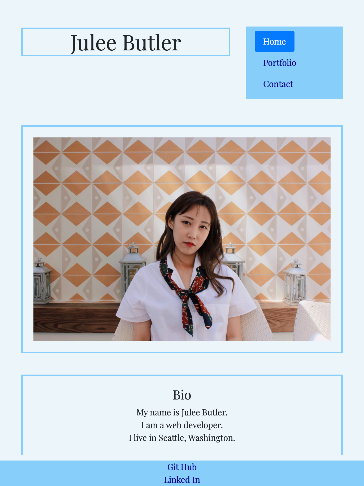
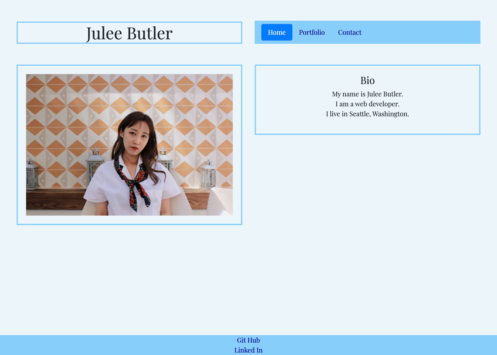
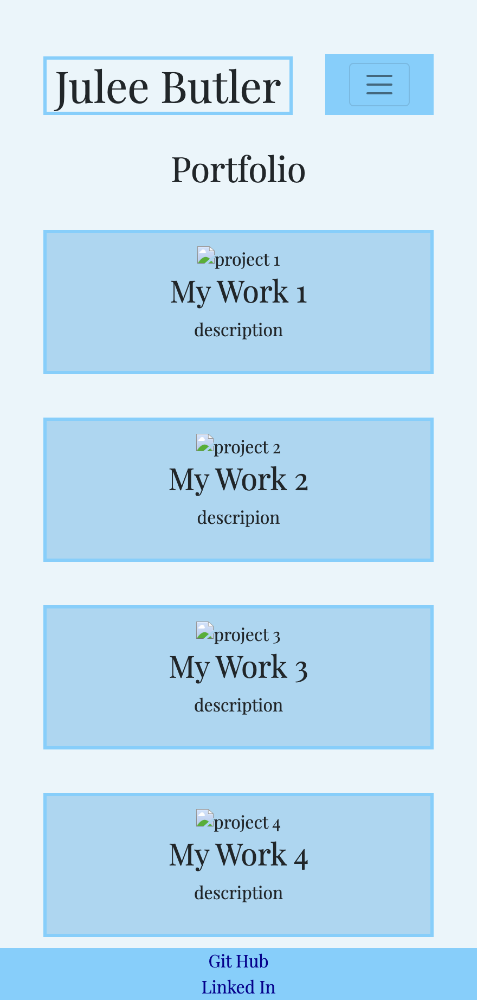
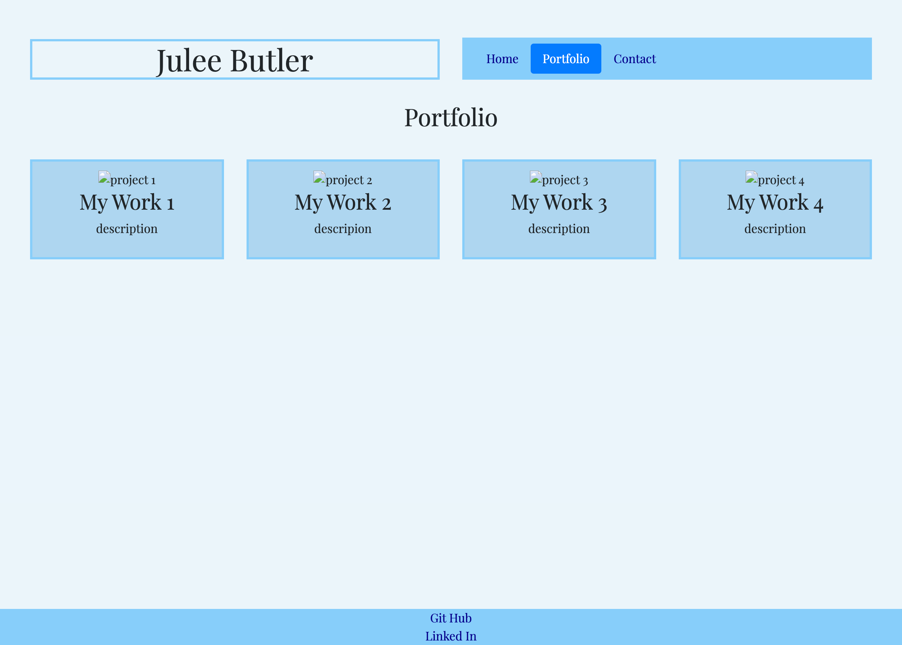
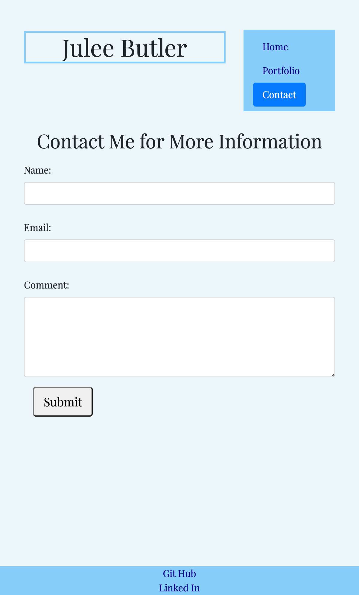
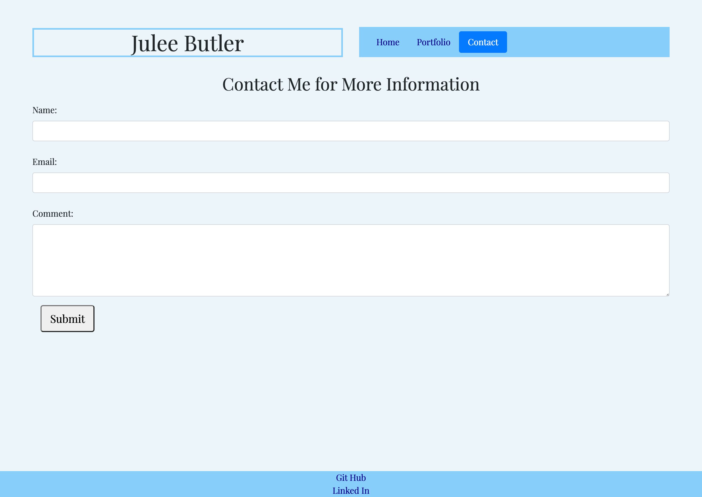

# portfolio
About the Project:

Creating portfolio for projects display.

Image Preview:

Descriptions of Project:

-Semantic HTML elements are used.

-Structures are in logical structures in positioning and styling.

-Bootstrap is used for nav bars.

-Booostrap grid system is used for responsive layouts.

-Responsive img for all layouts.

-Sticky footer is included. 

Deploy Link:

https://juleeb.github.io/portfolio/

